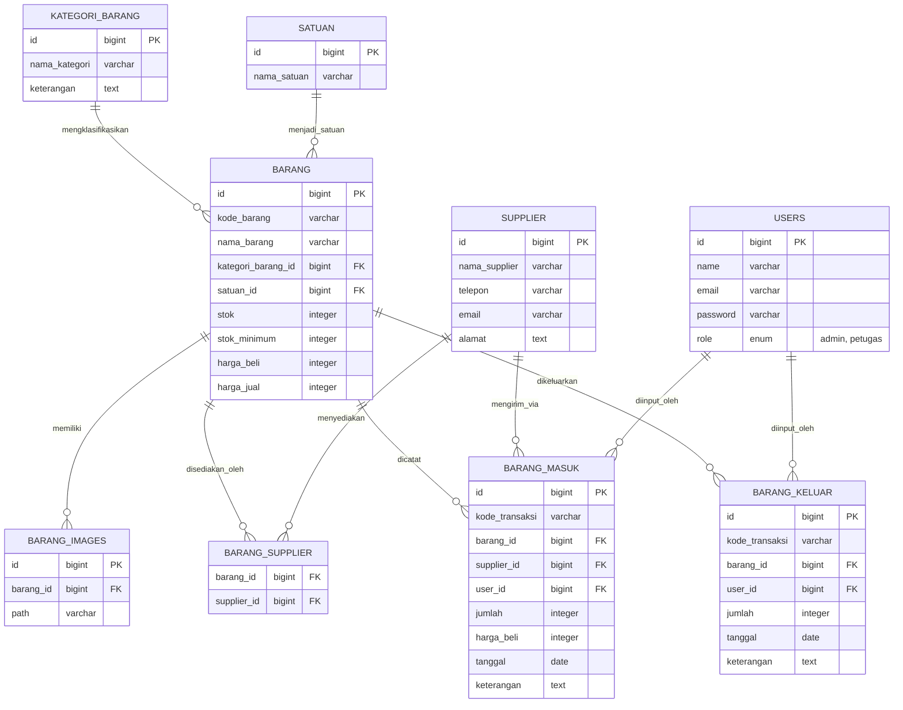

<div align="center">
  
# 📦 Rapih Inventory System

Sebuah sistem manajemen inventaris modern berbasi Web (Laravel 12) yang dibangun dengan standar kualitas tinggi, keamanan, dan desain UI/UX yang memanjakan mata. Dirancang khusus untuk memonitor siklus barang masuk dan barang keluar secara akurat dan konsisten.


</div>

---

## ✨ Fitur Utama

Aplikasi ini mencakup semua kebutuhan dasar hingga menengah untuk pengelolaan gudang / inventory:

- 🔒 **Role-Based Access Control (RBAC):**
  - **Admin:** Memiliki kontrol penuh atas Master Data, Laporan, dan melihat Activity Log (Audit Trail).
  - **Petugas:** Hanya memiliki akses untuk melakukan pencatatan transaksi (Barang Masuk & Barang Keluar).
- 📦 **Manajemen Master Data Terintegrasi:** 
  - Kategori Barang, Satuan, Supplier.
  - Barang dengan dukungan multi-supplier (Many-to-Many) dan galeri multi-gambar (Multiple Image Upload).
- 🔄 **Transaksi Konsisten:**
  - Pencatatan Barang Masuk & Barang Keluar.
  - Validasi ketat pada barang keluar (stok tidak boleh minus).
  - Update stok dilakukan otomatis melalui Eloquent Observers.
- 📊 **Dashboard & Analytics:** 
  - Grafik tren aktivitas (Masuk vs Keluar) selama 6 bulan terakhir menggunakan Chart.js.
  - Monitoring stok kritis.
- 📄 **Reporting:** Export laporan data stok dalam format Excel (.xlsx) dan PDF yang siap cetak.
- 🕵️ **Audit Trail (Activity Log):** Mencatat setiap aktivitas manipulasi data (Create, Update, Delete) oleh setiap pengguna.
- 🌙 **Modern UI/UX:** Desain *glassmorphism*, *animated gradient*, serta dukungan *Dark Mode* penuh berbasis Tailwind CSS dan Alpine.js.

---

## 📸 Cuplikan Aplikasi (Screenshots)

Berikut adalah dokumentasi antarmuka dari aplikasi Rapih Inventory:

<details>
<summary><b>Klik untuk melihat Halaman Autentikasi</b></summary>
<br>

**Halaman Login**


**Halaman Register**

</details>

<details>
<summary><b>Klik untuk melihat Tampilan Admin</b></summary>
<br>

**Dashboard Admin**


**Manajemen Data & Master Data**


*(Catatan: Terdapat total 14 tangkapan layar untuk fitur Admin di folder `public/assets/`, mencakup kelengkapan Manajemen Barang, Supplier, Log Aktivitas, Laporan Excel/PDF, dll).*
</details>

<details>
<summary><b>Klik untuk melihat Tampilan Petugas</b></summary>
<br>

**Dashboard Petugas**


**Transaksi Barang**


*(Catatan: Terdapat total 7 tangkapan layar untuk fitur Petugas di folder `public/assets/`, difokuskan pada pengelolaan sirkulasi Barang Masuk dan Keluar).*
</details>

---

## 🛠 Teknologi yang Digunakan

- **Backend:** Laravel 12 (PHP 8.5)
- **Frontend:** Laravel Blade, Tailwind CSS (via CDN), Alpine.js
- **Database:** MySQL
- **Packages & Libraries:**
  - `laravel/breeze` (Sistem Autentikasi)
  - `spatie/laravel-activitylog` (v4.x untuk sistem log/audit)
  - `maatwebsite/excel` (v4.x-dev untuk export XLSX di PHP 8+)
  - `barryvdh/laravel-dompdf` (Export dokumen PDF)
  - `chart.js` (Visualisasi data di Dashboard)

---

## 🚀 Instalasi & Setup

Ikuti langkah-langkah berikut untuk menjalankan sistem secara lokal:

### Prasyarat
- PHP 8.5 atau yang lebih baru
- Composer
- MySQL Database

### Langkah-langkah
1. **Clone Repository (atau siapkan direktori project)**
   ```bash
   git clone <repository_url> rapih
   cd rapih
   ```

2. **Install Dependensi Composer**
   ```bash
   composer install
   ```

3. **Setup Konfigurasi Environment**
   ```bash
   cp .env.example .env
   php artisan key:generate
   ```
   Buka file `.env` dan konfigurasikan koneksi database Anda:
   ```env
   DB_CONNECTION=mysql
   DB_HOST=127.0.0.1
   DB_PORT=3306
   DB_DATABASE=rapih
   DB_USERNAME=root
   DB_PASSWORD=
   ```

4. **Migrasi Database & Seeding Dummy Data**
   Sistem ini dilengkapi dengan factory dan seeder untuk menghasilkan data realistis.
   ```bash
   php artisan migrate:fresh --seed
   ```

5. **Symlink Storage (Untuk Gambar Barang)**
   ```bash
   php artisan storage:link
   ```

6. **Jalankan Aplikasi**
   ```bash
   php artisan serve
   ```
   Aplikasi dapat diakses melalui browser di `http://localhost:8000`.

---

## 🔐 Kredensial Default (Dari Seeder)

Gunakan kredensial berikut untuk menguji sistem berdasarkan role:

| Role | Email | Password | Hak Akses |
|---|---|---|---|
| **Admin** | `admin@rapih.test` | `password` | Semua Modul, Master Data, Laporan, Activity Log |
| **Petugas** | `budi@rapih.test` | `password` | Hanya Dashboard & Transaksi (Masuk/Keluar) |
| **Petugas** | `siti@rapih.test` | `password` | Hanya Dashboard & Transaksi (Masuk/Keluar) |

---

## 🏗 Struktur Database (Schema)

Sistem menggunakan database relasional dengan rancangan berikut:



Selain tabel di atas, terdapat tabel bawaan Laravel dan package:
- **`activity_log`**: Dikelola oleh package *Spatie* untuk mencatat histori (*Audit Trail*).
- **`migrations`, `password_reset_tokens`, `sessions`**: Struktur dasar Laravel.

---

> *Dikembangkan untuk memenuhi spesifikasi sistem inventaris tingkat menengah. Built with ❤️ utilizing Laravel.*
